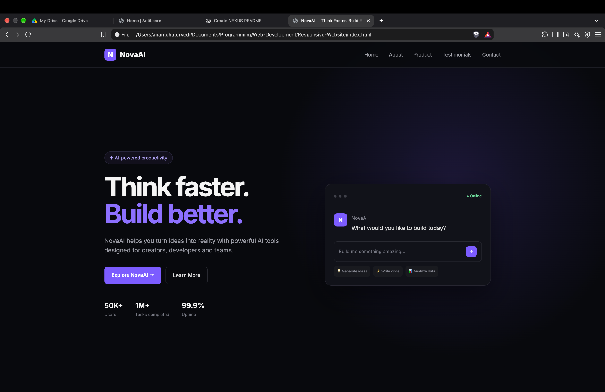
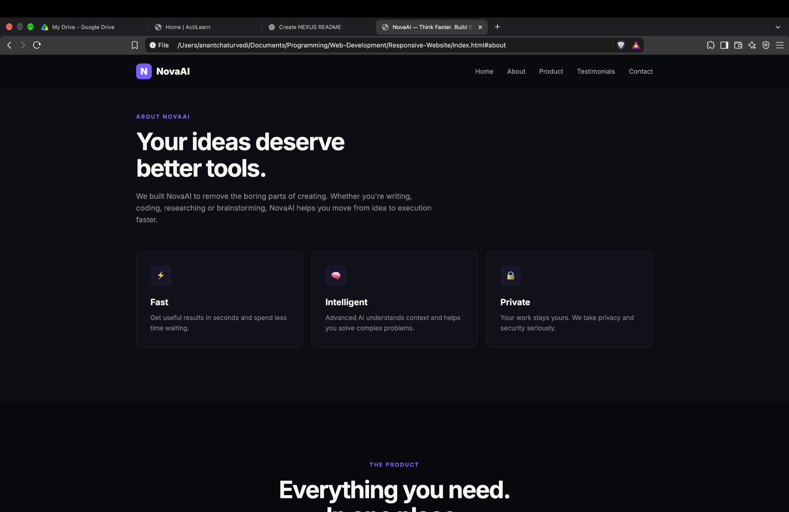
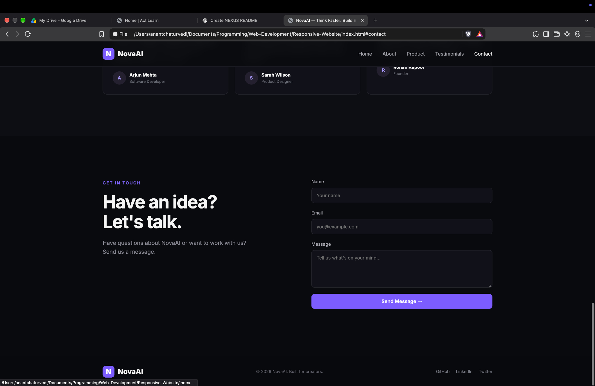

# NovaAI — Responsive Website

> A responsive AI-product website built with **HTML5, CSS3, and JavaScript** as part of the **Technojam 2026 Web Development recruitment task**.

<p align="center">
  <strong>Think faster. Build better.</strong><br>
  A clean, dark-themed product website for a fictional AI productivity platform.
</p>

---

## 🌐 Project Overview

**NovaAI** is a responsive website for an AI productivity product aimed at **creators, developers, and teams**.

The site focuses on a simple product-style experience with a consistent dark UI, purple accent color, responsive layouts, and lightweight JavaScript interactions.

### Pages

| Page | Purpose |
| --- | --- |
| 🏠 **Home** | Product introduction, main headline, CTA, and key highlights |
| ℹ️ **About** | Product overview and core values |
| 🛍️ **Product** | Product features and capabilities |
| ⭐ **Testimonials** | User reviews and feedback |
| 📩 **Contact** | Contact section with an interactive form |

---

## ✨ Features

- 📱 Responsive layout for different screen sizes
- 🎨 Consistent dark visual theme and typography
- 🧭 Mobile-friendly navigation
- ⚡ Lightweight frontend
- 🖱️ Interactive UI elements using JavaScript
- 📩 Contact form interaction and validation
- 🧩 Consistent styling across all pages
- 🖥️ Product-style landing page design

---

## 🛠️ Technologies Used

| Technology | Used For |
| --- | --- |
| **HTML5** | Structure and semantic markup |
| **CSS3** | Styling, layouts, responsiveness, and visual design |
| **JavaScript** | Frontend interactions and form behaviour |

---

## 🚀 Run Locally

This is a static website, so no backend or package installation is required.

Clone the repository:

```bash
git clone <your-repository-url>
cd <your-project-folder>
```

Open `index.html` in a browser.

For development, you can also use **VS Code + Live Server** for automatic browser refreshes while editing.

---

## 🧪 Testing / Screenshots

These screenshots were captured while testing the website.

### 🏠 Home Page

<p align="center">
  
</p>

The home page contains the main product introduction, primary call-to-action buttons, product highlights, and an AI interface preview.

### ℹ️ About Page

<p align="center">
  
</p>

The about section explains the product and presents its main ideas through feature cards.

### 📩 Contact Page

<p align="center">
  
</p>

The contact section includes the form used to test user input and frontend form interaction.

---

## 🧠 Development Process

This is one of my first projects focused on the web-development side of programming.

Until now, most of my focus had been on **DSA and programming fundamentals**, so this project gave me a chance to learn how HTML, CSS, and JavaScript work together to build a real user-facing website.

I used **AI as a learning and development assistant** during the project. It helped me understand concepts, structure parts of the website, write portions of the code, and troubleshoot issues.

Because of that, the project was **not built entirely from scratch by me**. I am keeping that distinction clear because the main goal was to learn the development process and understand the code and concepts involved.

---

## 📚 What I Learned

Through this project, I worked with:

- Structuring multi-section pages with HTML
- Building responsive layouts with CSS
- Creating consistent navigation and page styling
- Using JavaScript for frontend interactions
- Handling form input and validation
- Designing for different screen sizes
- Turning a product idea into a working website

---

## 📌 Task Source

This project was completed as part of the:

**Technojam 2026 Recruitment Tasks**  
**Domain:** Web Development

**Task:** Build a responsive website for a product of choice using HTML, CSS, and JavaScript.

---

## 📁 Testing Assets

The repository can contain the screenshots used in this README:

```text
testing-images/
├── home.png
├── about.png
└── contact.png
```

Keeping these images in the repository means the screenshots will render directly on the GitHub README.

---

## 👤 Author

**Anant Chaturvedi**

Built as a learning project for the **Technojam 2026 recruitment process**.

---

<p align="center">
  Made while learning web development, one section at a time.
</p>
